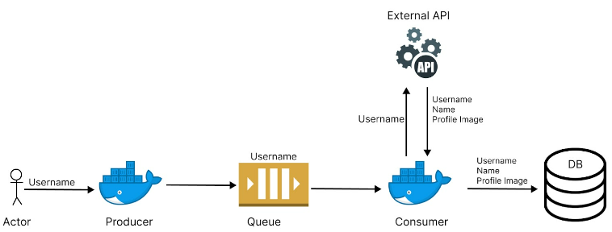

# DS Work

## Introduction

Work of the Special Topics in Networks and Distributed Systems discipline that uses Docker Compose to orchestrate four interconnected Docker containers.

The system is composed of the containers: **producer**; **queue**; **consumer**; and **db** (database). 

Work architecture:

The API used in the project was the [Instagram Profile](https://rapidapi.com/fariswdcash-434L2ELS8qx/api/instagram-profile1/). The API takes an Instagram userName and returns that user's real name and profile picture.

## Containers
The **db** container is running on a [postgres image](https://hub.docker.com/_/postgres) and the others containers on [Node images](https://hub.docker.com/_/node). All requests are made using [Axios](https://axios-http.com/docs/intro).

All containers run on the "net" network, created in Docker Compose. They can be accessed via http://localhost:*port*.

### producer
The producer sends to the queue all the userNames that are in the *assets/data.txt* file.
This server run on port **3010**.

### queue
When the queue container receives a userName, it sends it to the consumer until the queue is empty.

This server run on port **3011**.

### consumer
The consumer receives the userName from the queue and sends it to the API, if there is no problem it saves it in the database in the format: **[userName, realName, imageLink]**.

This server run on port **3012**.

### db
Finally, the consumer saves the data in the container table **db** *(instagram_profile*) that has the fields:
user_name; real_name; and img.

## How to use